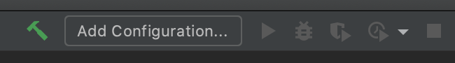
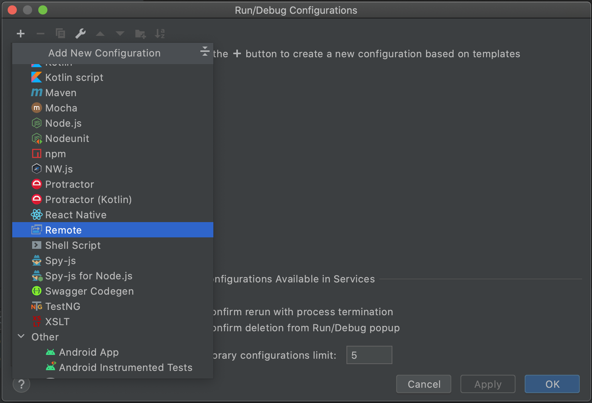
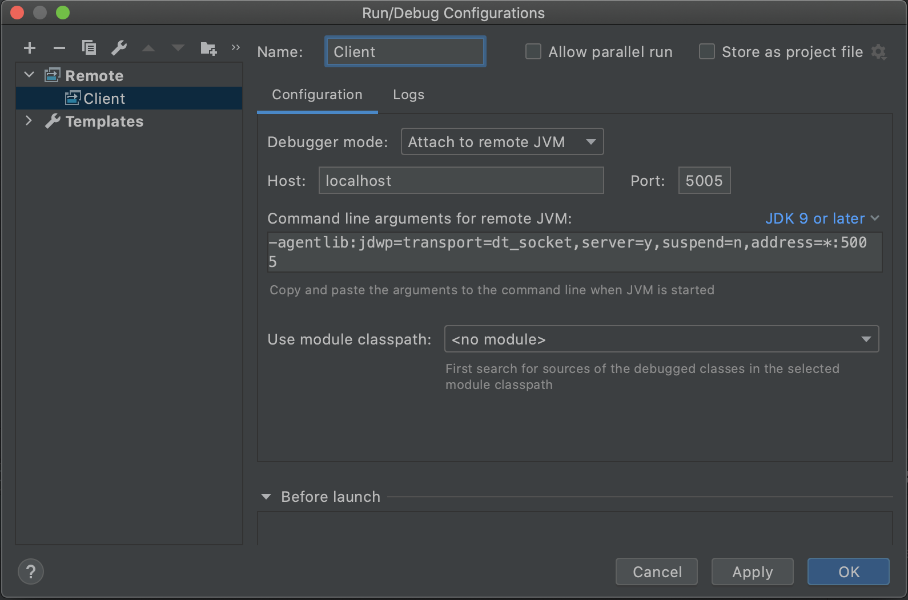
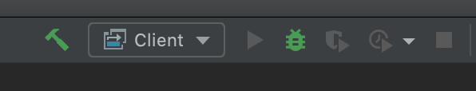

# Docker Overview

Docker is **not** required for this course, however it is recommended to test if your implementation works inside the provided Docker-environment and therefore in the testing-environment.

## Setup

In this tutorial we will show you in detail how to install Docker and Docker-Compose for Ubuntu 20.04. Other Linux-distributions, Windows and Mac have a different procedure, which we will not cover in detail. Documentation is however available on the official Docker website which can be found here:

* [Windows](https://docs.docker.com/docker-for-windows/install/) (The linux subsystem WSL, is needed to run Docker, which you have to install separately)
* [Mac](https://docs.docker.com/docker-for-mac/install/)
* [CentOS](https://docs.docker.com/engine/install/centos/)
* [Debian](https://docs.docker.com/engine/install/debian/)
* [Fedora](https://docs.docker.com/engine/install/fedora/)
* [Ubuntu (<20.04)](https://docs.docker.com/engine/install/ubuntu/)

Docker-Compose is bundled with Docker-Desktop for Mac and Windows. On Linux you have to install it separatly. You can do this by executing the following commands:

> sudo curl -L "https://github.com/docker/compose/releases/download/1.27.4/docker-compose-$(uname -s)-$(uname -m)" -o /usr/local/bin/docker-compose

> sudo chmod +x /usr/local/bin/docker-compose

For **>=Ubuntu 20.04** the installation procedure is much simpler. Docker and Docker-Compose can be installed from the apt package manager.

> sudo apt install docker.io docker-compose

Theoretically you don't have to do more, however you would need to use sudo to execute docker-commands. This can be omitted by adding the user to the docker group. **From a security standpoint this is basically the same as giving this user root privilges!**

> sudo usermod -a -G docker $USER

You have to login again for these changes to take affect.

Now we can use Docker and Docker-compose.\
For this course you don't have to know more about Docker, however if you are interested down below you will find some more informations.

## Basics

Docker is a virtualisation software, which makes it possible to create containers on a host system and execute those isolated. You can choose yourself if the container is completely isolated or if you can communicate over the network, share directories, devices,...\
You can also determine how much ram and cpu can be used by the container.

Every container can have multiple processes running like a normal computer, however it will stop if the main process gets stopped.

Containers are an instance of an image. These images define what software will run in the container, what the main process is (entrypoint), environment variables,...\
All of those can also be changed during the runtime of the container and/or creation of the container.

There are also some options which can only be configured on the container, like port or device mapping.\
\
In the following we show you some useful commands to interact with docker containers and images from the command line. Note that on Windows and Mac the docker-engine install comes with a graphical frontend, and the dashboard lets you see all available images and containers, which containers are running, as well as letting you remove an image or stop a running container by the push of a button.

## Commands

* `docker` - Overview
* `docker ps` - List all running Containers
* `docker ps -a` - List all Containers (also not running)
* `docker run` - Run a new Container from Image with additional Flags
  * `--name` - Name of the Container
  * `-p` - Ports to pass through from Container to Host
  * `-v` - Volume/Directory to mount inside Volume
  * `-i` - Open STDIN without being attached to the main process
  * `-t` - Pseudo TTY
* `docker exec` - Execute another process in a already running container
* `docker start <containername>` - Start a container
* `docker stop <containername>` - Stop a container
* `docker stats` - Show ram/cpu/io-usage
* `docker kill <containername>` - Kill a container
* `docker rm <containername>` - Remove a container (it has to be stopped before)
* `docker images` - List all Images
* `docker rmi <imagename>` - Remove image (Must not be used by any containers)

## Compose

Docker-Compose can be used on top of docker for easier management. In the commands section you can see, that there are multiple arguments for the run command. We only have described some of them, there are many more. With so many arguments it is easier for us to use a configuration file where we define how the container(s) should be created. With such a configuration we can also easily update the containers setup. This configuration is a docker-compose.yml-file. We won't go more into detail, however you can have a look at the docker-compose.yml in the root-directory of your repository. If you want to know more, you can have a look at the documentation [here](https://docs.docker.com/compose/compose-file/).

## OOP2

* `./docker/createDocker.sh` - Creates multiple Dockercontainers with (nearly) the same Environment that we use to test the assignments.
* `./docker/mvn.sh` - Executes `mvn clean install` inside Docker, i.e, this script builds the whole framework. 
* `./docker/server.sh` - Starts the Analysis Server inside Docker.
* `./docker/client.sh <COMMAND> <ARGS>` - Connects to the Analysis Server inside Docker and performs one command.
* `./docker/client.sh` - Connects to the Analysis Server inside Docker and opens the cli to enter commands.
* `./docker/debugclient.sh` - Same as client.sh with an additional debugger as described below
* `./docker/debugserver.sh` - Same as server.sh with an additional debugger as described below

### Debugging

If your programs crash inside docker or you want to develop with docker, you probably want to use the debugging functionality of your ide. Below we will describe how this can be achieved with IntelliJ.

1. Open your project with Intellij
2. In the top right of the window you can click on "Add Configuration...". Alternatively you can do this inside the menu "Run > Edit Configurations..."   

3. Click on the "+" on the top left, followed by "Remote"   

4. Give the configuration a meaningful name like "Client" 
5. Make sure the Debugger Mode is set to "Attach to remote JVM", Host is "localhost" and Port is "5005" to debug the Client

6. Click Apply to save the configuration
7. Repeat steps 3-6 to create a configuration for the server (You should change the configurationname and set the Port to "5006" to debug the Server) and then exit this window by clicking OK

8. Start ./docker/debugclient.sh or ./docker/debugserver.sh
9. Select the corresponding configuration in the top right corner (Client or Server)
10. Click on the Debug Icon   

11. Debug your application